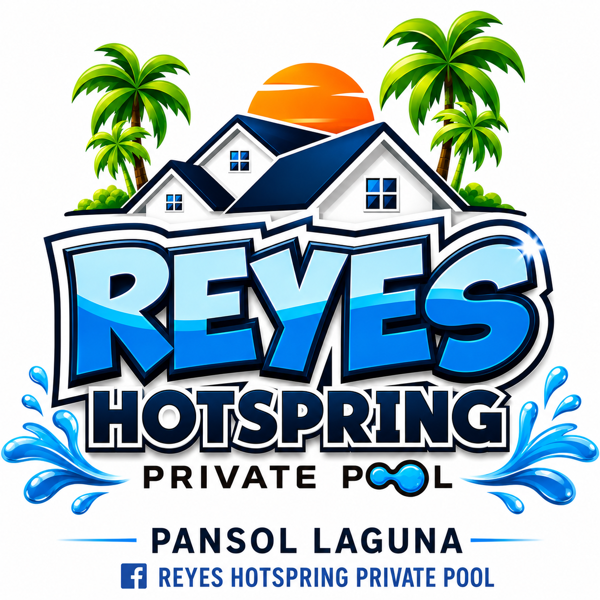
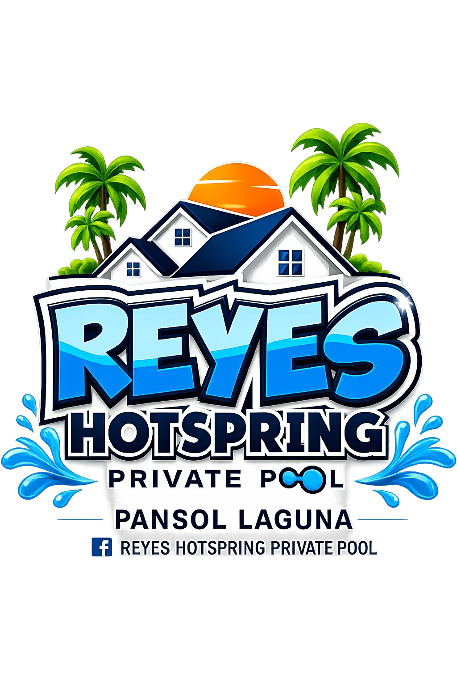
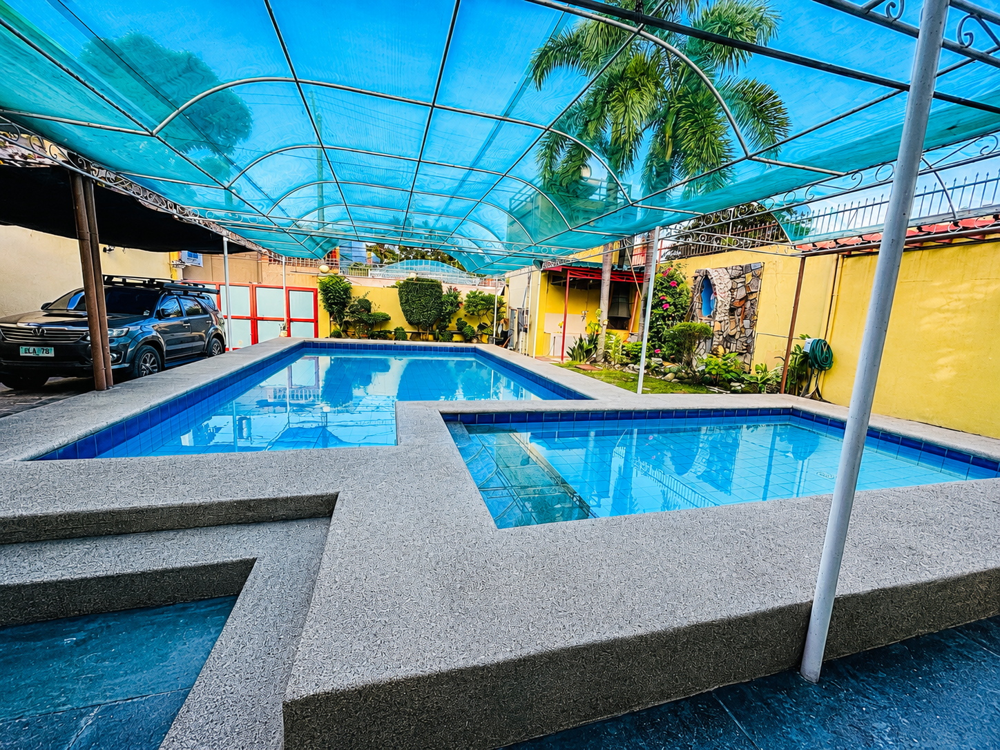
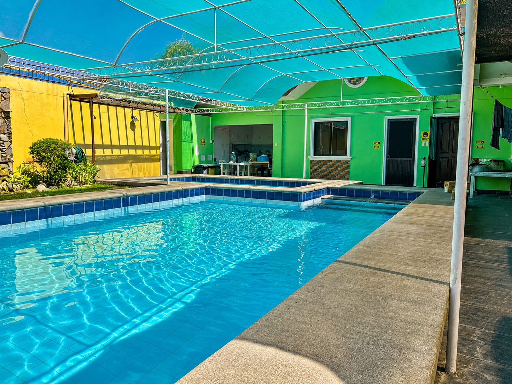
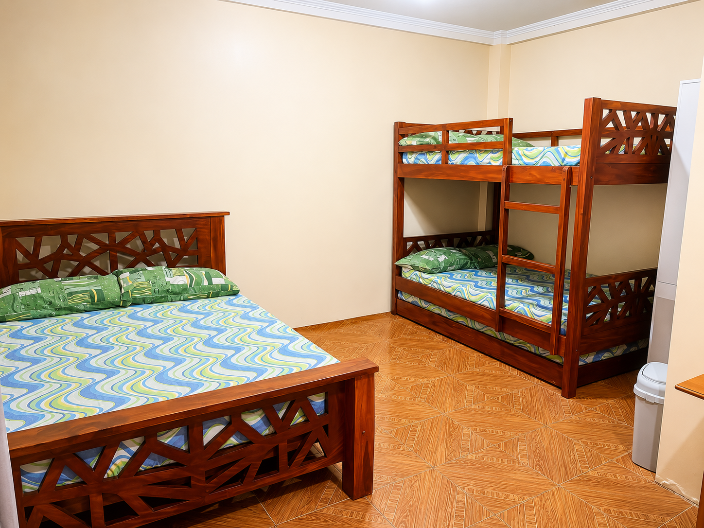
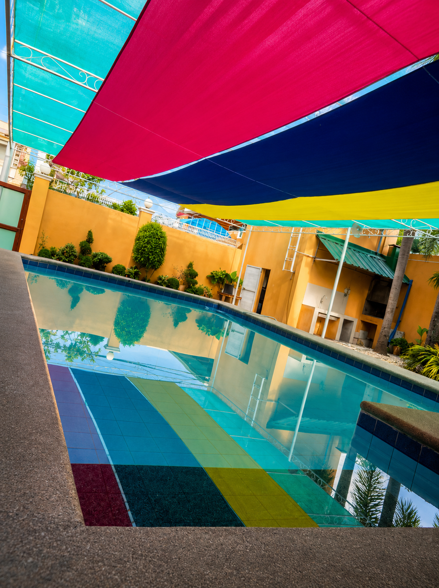

<html lang="en">
<head>
<meta charset="UTF-8">
<meta name="viewport" content="width=device-width, initial-scale=1.0">

<title>Reyes Hotspring Private Pool</title>

<link href="https://fonts.googleapis.com/css2?family=Poppins:wght@300;400;500;600;700;800&display=swap" rel="stylesheet">

</head>
<body>

<header>
<nav>

Reyes Hotspring

<ul>
<li><a href="#about">About</a></li>
<li><a href="#gallery">Gallery</a></li>
<li><a href="#rates">Rates</a></li>
<li><a href="#contact">Contact</a></li>
</ul>

</nav>
</header>

<section class="hero">

<h1>Reyes Hotspring Private Pool</h1>

Your Private Tropical Escape in Pansol, Calamba Laguna

<a href="#rates" class="btn">
View Rates
</a>

</section>

<section id="about">

<h2 class="section-title">
Welcome to Reyes Hotspring Private Pool
</h2>

Enjoy a relaxing getaway with natural hotspring pools,
airconditioned rooms, videoke, WiFi and complete amenities
perfect for family gatherings, reunions and staycations.

</section>

<section id="gallery">

<h2 class="section-title">
Gallery
</h2>

</section>

<section>

<h2 class="section-title">
Amenities
</h2>

<h3>💦 Natural Hotspring Pool</h3>

<h3>🛝Adult / Kiddie Pool</h3>

<h3>🛏️ 2 Airconditioned Rooms</h3>

<h3>📶 Free WiFi</h3>

<h3>🎤 Videoke</h3>

<h3>🚘 Parking Area</h3>

</section>

<section id="rates">

<h2 class="section-title">
💰 Resort Rates
</h2>

<h3>☀️ Day Tour</h3>
<ul>
<li>Weekday: ₱6,000</li>
<li>Weekend: ₱7,000</li>
</ul>

<h3>🌙 Night Tour</h3>
<ul>
<li>Weekday: ₱7,000</li>
<li>Weekend: ₱8,000</li>
</ul>

<h3>🏡 22 Hours Stay</h3>
<ul>
<li>Weekday: ₱10,000</li>
<li>Weekend: ₱12,000</li>
</ul>

</section>

<section class="policy">

<h2 class="section-title" style="color:white;">
Reservation Policy
</h2>

✅ 50% Reservation Fee Required

✅ No Downpayment = No Reservation

✅ First Come First Served

❌ Downpayment is Strictly Non-Refundable

</section>

<section id="contact">

<h2 class="section-title">
Contact Us
</h2>

<h3>📍 1-303 Kaimo
  St. Purok 1, Pansol, Calamba City, Laguna</h3>

 

<h2>0917-806-4028</h2>
<h2>0915-289-6007</h2>

<a href="https://wa.me/639178064028" class="btn whatsapp">
WhatsApp
</a>

<a href="https://www.facebook.com/ReyesHotspringPrivatePool" class="btn facebook">
Facebook
</a>

<a href="https://maps.app.goo.gl/f5ZqU8sMzpRiNgy3A?g_st=ic" class="btn">
Google Maps
</a>

</section>

<footer>
© 2025 Reyes Hotspring Private Pool | Pansol, Calamba Laguna
</footer>

<a href="https://wa.me/639178064028" class="float">
💬
</a>

</body>
</html>
